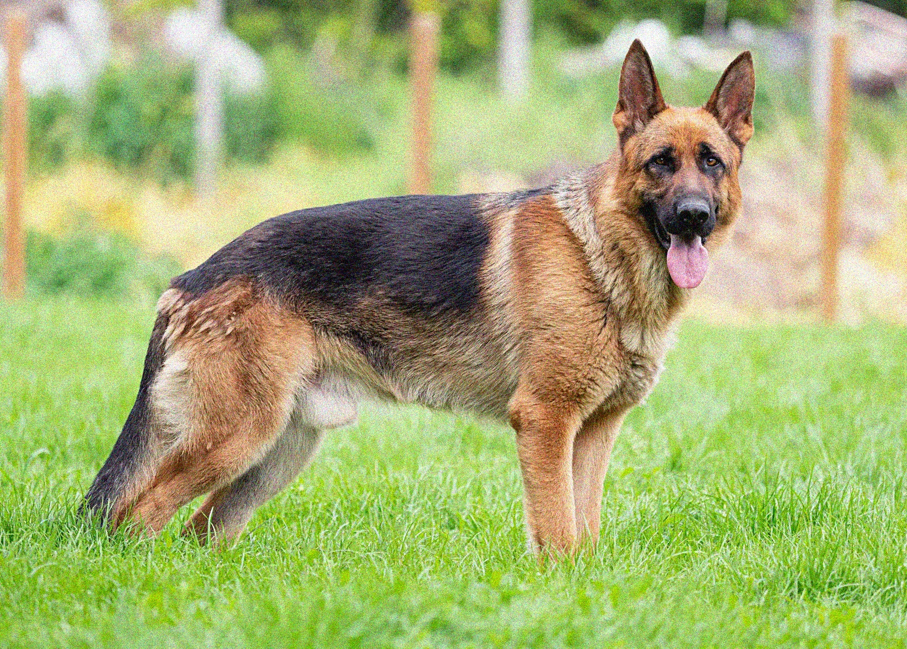

# DSP Image Filtering

This repository contains code for spatial filtering in the field of linear algebra. The code applies spatial filtering techniques to an input image, removing noise and enhancing image quality.

## Results

The code generates the following results:

### Original Image

### Noise

